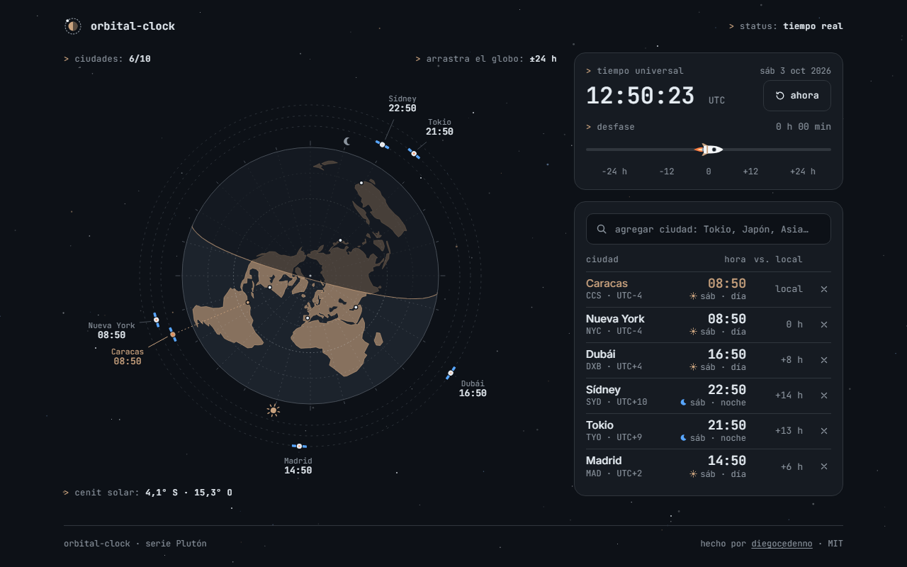

# orbital-clock

> A world clock seen from above the North Pole: the day/night terminator is computed from the real UTC time, and every city orbits the Earth as a satellite carrying its local time.
>
> Un reloj mundial visto desde encima del polo norte: el terminador día/noche se calcula con la hora UTC real y cada ciudad orbita la Tierra como un satélite con su hora local.

**[English](#english)** · **[Español](#español)**

---

## English

### What it does

- Draws the Earth in a polar azimuthal projection, so the globe works as a 24-hour dial: longitude is the angle and each meridian line is one hour.
- Shades the night side with the real terminator for the current instant. The Sun and Moon marks on the rim show where it is noon and midnight.
- Each city sits above its own meridian as a satellite on a dashed orbit, labelled with its local time. A table lists the same cities with their UTC offset, the difference from your own time zone and whether it is day or night there.
- Search any IANA time zone by city, country or region — accents are ignored, so `bogota` finds Bogotá. Caracas is there by default; add up to ten cities, remove them, and the list survives a reload (`localStorage`).
- Drag time ±24 h with the slider (or by dragging the globe with a mouse): the shadow and every clock turn together. **ahora** snaps back to real time.

### What makes it technically interesting

- **The terminator is real astronomy, not a rotated half-disc.** The subsolar point comes from the Astronomical Almanac's low-precision solar position (declination plus the equation of time), and the curve is the solution of `tan φ = −cos(λ − λ☉) / tan δ` for each longitude.
- **No division by zero at the equinox.** The curve is evaluated with `atan2`, so when the declination reaches 0 it degenerates on its own into the straight line through the pole. The pole ends up lit or dark depending on the season, and the fill rule flips accordingly.
- **Dragging time only writes a `transform`.** In this projection the night shape depends on the declination alone; the hour is a rotation. The path is rebuilt only when the declination drifts, and scrubbing ±24 h is a single rotating group at 60 fps.
- **Time zones without a time-zone library.** Local times and UTC offsets are read back from `Intl.DateTimeFormat` with `formatToParts`, with one cached formatter per zone. The search index is built from `Intl.supportedValuesOf("timeZone")` and falls back to the bundled city table.
- **Labels that do not collide.** Satellites are spread over three orbits, and labels rest on an outer circle where overlapping boxes push each other apart around the globe; a thin leader line ties each label to its satellite.
- **Hand-drawn low-poly continents.** No map data is downloaded: about thirty simplified outlines live in `js/data.js` as longitude/latitude pairs and are projected at runtime. Zones outside the 86-entry city table get an approximate longitude from their UTC offset (15° per hour) and are marked with `≈`.
- **Reduced motion is a first-class path.** With `prefers-reduced-motion` nothing spins: the clocks jump to the new time and the night shadow cross-fades between two layers.
- **Accessible.** The search is an ARIA combobox with a listbox, the slider is a native range input with a spoken value, and the scene is mirrored by a real table.
- **Zero dependencies, zero build.** Plain HTML, CSS and JavaScript. Fonts are bundled; nothing is requested from the network.

### Keyboard

| Key | Action |
| --- | --- |
| Type in the search field | Filter cities and time zones |
| `↑` `↓` | Move through the results |
| `Enter` | Put the highlighted city in orbit |
| `Esc` | Close the results |
| `←` `→` on the slider | Shift time by 15 minutes |
| `Home` `End` on the slider | Jump to −24 h / +24 h |

### Run it

Double-click `index.html`. That is all — there is no build step and no server.
It also works as-is on GitHub Pages.

### License

[MIT](LICENSE) © Diego Cedeño. Inter and JetBrains Mono are bundled under the [SIL Open Font License](assets/fonts/).

---

## Español

### Qué hace

- Dibuja la Tierra en proyección azimutal polar, así que el globo funciona como un dial de 24 horas: la longitud es el ángulo y cada meridiano es una hora.
- Sombrea el lado de la noche con el terminador real del instante actual. Las marcas del Sol y la Luna en el borde indican dónde es mediodía y medianoche.
- Cada ciudad queda sobre su meridiano como un satélite en una órbita punteada, con su hora local. Una tabla repite las mismas ciudades con su desfase UTC, la diferencia respecto a tu zona horaria y si allí es de día o de noche.
- Busca cualquier huso IANA por ciudad, país o región, sin distinguir acentos: `bogota` encuentra Bogotá. Caracas viene por defecto; puedes agregar hasta diez ciudades, quitarlas, y la lista sobrevive a una recarga (`localStorage`).
- Arrastra el tiempo ±24 h con el control (o arrastrando el globo con el ratón): la sombra y todos los relojes giran a la vez. **ahora** vuelve al tiempo real.

### Qué lo hace interesante técnicamente

- **El terminador es astronomía de verdad, no medio disco girado.** El punto subsolar sale de la posición solar de baja precisión del Astronomical Almanac (declinación más ecuación del tiempo), y la curva es la solución de `tan φ = −cos(λ − λ☉) / tan δ` para cada longitud.
- **Sin división entre cero en el equinoccio.** La curva se evalúa con `atan2`, así que cuando la declinación llega a 0 degenera sola en la recta que pasa por el polo. El polo queda iluminado o a oscuras según la estación, y la regla de relleno se invierte con él.
- **Arrastrar el tiempo solo escribe un `transform`.** En esta proyección la forma de la noche depende únicamente de la declinación; la hora es un giro. El trazado se rehace solo cuando la declinación cambia, y recorrer ±24 h es un único grupo girando a 60 fps.
- **Husos horarios sin librería de husos.** Las horas locales y los desfases UTC se leen de `Intl.DateTimeFormat` con `formatToParts`, con un formateador en caché por zona. El índice del buscador sale de `Intl.supportedValuesOf("timeZone")` y, si no existe, de la tabla de ciudades incluida.
- **Etiquetas que no se pisan.** Los satélites se reparten en tres órbitas y las etiquetas se apoyan en un círculo exterior donde las cajas que se solapan se empujan alrededor del globo; una línea fina une cada etiqueta con su satélite.
- **Continentes low-poly dibujados a mano.** No se descarga cartografía: una treintena de contornos simplificados viven en `js/data.js` como pares longitud/latitud y se proyectan en tiempo de ejecución. Los husos fuera de la tabla de 86 lugares reciben una longitud aproximada a partir de su desfase UTC (15° por hora) y se marcan con `≈`.
- **El movimiento reducido es un camino de primera clase.** Con `prefers-reduced-motion` nada gira: los relojes saltan a la nueva hora y la sombra de la noche se funde entre dos capas.
- **Accesible.** El buscador es un combobox ARIA con lista, el control es un `input` de rango nativo con valor hablado, y la escena tiene su reflejo en una tabla real.
- **Cero dependencias, cero build.** HTML, CSS y JavaScript sin más. Las fuentes van incluidas; no se pide nada a la red.

### Teclado

| Tecla | Acción |
| --- | --- |
| Escribir en el buscador | Filtrar ciudades y husos horarios |
| `↑` `↓` | Recorrer los resultados |
| `Enter` | Poner en órbita la ciudad resaltada |
| `Esc` | Cerrar los resultados |
| `←` `→` en el control | Mover el tiempo 15 minutos |
| `Inicio` `Fin` en el control | Saltar a −24 h / +24 h |

### Cómo correrlo

Doble clic en `index.html`. Nada más: no hay build ni servidor.
También funciona tal cual en GitHub Pages.

### Licencia

[MIT](LICENSE) © Diego Cedeño. Inter y JetBrains Mono se incluyen bajo la [SIL Open Font License](assets/fonts/).
